# Platelet Segmentation Annotation Guide

This repository contains a custom annotation tool for reviewing and editing platelet segmentation masks on time-series `.tif` image stacks. It also documents a Napari-based workflow for users who prefer a standard scientific image viewer.

The goal of the workflow is to produce high-quality ground truth masks for segmentation and tracking: one consistent label ID per platelet, accurate boundaries, stable tracking across frames, and careful handling of fine structures such as filopodia.

This project is based on the original `label_tools` repository by Wenwen La:
<https://github.com/wenwenla/label_tools>

## Table of Contents

1. [Installing the Custom Annotation Software](#1-installing-the-custom-annotation-software)
2. [Installing Napari](#2-installing-napari)
3. [What to Look For When Annotating](#3-what-to-look-for-when-annotating)
4. [How to Use the Custom Annotation Software](#4-how-to-use-the-custom-annotation-software)
5. [How to Use Napari](#5-how-to-use-napari)
6. [Suggested Additions and Documentation Structure](#6-suggested-additions-and-documentation-structure)
7. [Building the App](#7-building-the-app)

---

## 1. Installing the Custom Annotation Software

Use the custom annotation software if you are on Windows and want the dedicated platelet mask cleanup workflow.

### 1.1 Download

Download the latest release here:

<https://github.com/rocket770/label_tools/releases/tag/Release>

After downloading, unzip the release folder.

### 1.2 Launch

Open the extracted folder and launch:

```text
main.exe
```

The application opens in a maximized windowed mode so the normal Windows title bar and taskbar remain visible.

### 1.3 Supported Inputs

The software supports:

- Image stack: `.tif`
- Mask stack: `.npz`

You can load a `.tif` and `.npz` together or separately. Once loaded, the current filenames appear in the left panel.

---

## 2. Installing Napari

Use Napari if you want a cross-platform annotation option for Windows, macOS, or Linux.

### 2.1 Install Anaconda

Download and install Anaconda:

<https://www.anaconda.com/download>

After installation, restart your computer so the `conda` command is available in a new terminal.

### 2.2 Create an Annotation Environment

Open a terminal or Anaconda Prompt and run:

```bash
conda create -n annotation python=3.11
```

Activate the environment:

```bash
conda activate annotation
```

Install Napari and the Qt backend:

```bash
conda install -c conda-forge napari pyqt
```

Verify the installation:

```bash
napari --version
```

Launch Napari:

```bash
napari
```

---

## 3. What to Look For When Annotating

### 3.1 Objective

The objective is to create a precise mask over the cells. This mask is the ground truth and can be used for evaluating segmentation models or training deep learning models.

Every label should represent one real platelet. The same platelet should keep the same ID across the full time series.

<table>
<tr>
<td align="center">
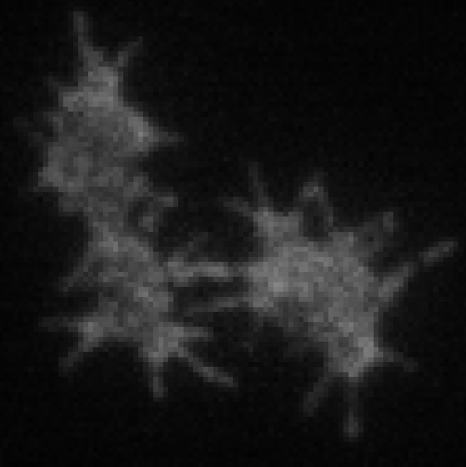<br/>
<em>Original grayscale image (.tif)</em>
</td>
<td align="center">
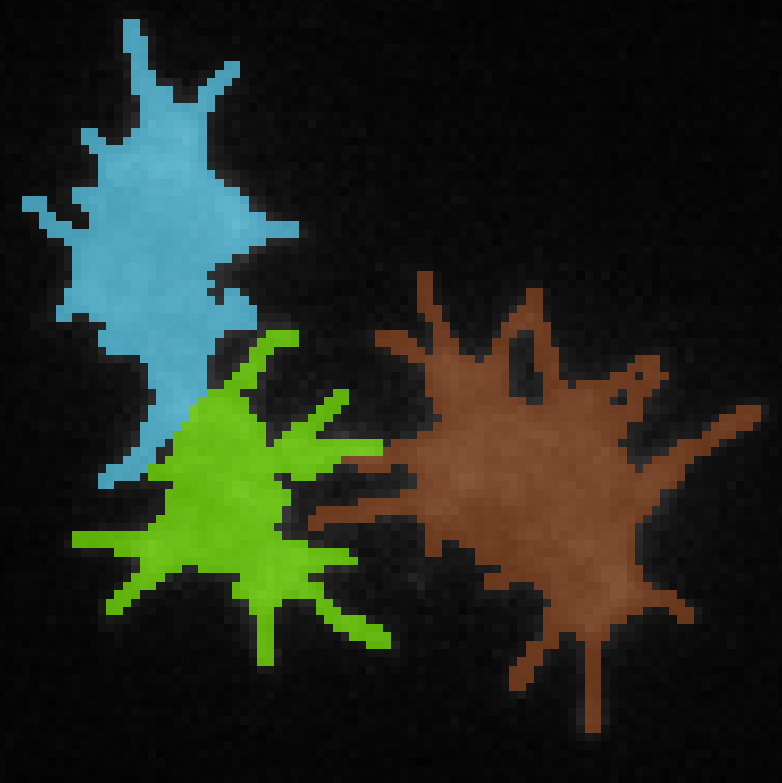<br/>
<em>Expected mask (.npz)</em>
</td>
</tr>
</table>

### 3.2 Start With the Time Series, Not Just One Frame

Before making detailed edits, inspect the time series to understand how many cells are really present and when each cell appears.

In this example, the final frame appears to show three adjacent cells:

<div align="left">
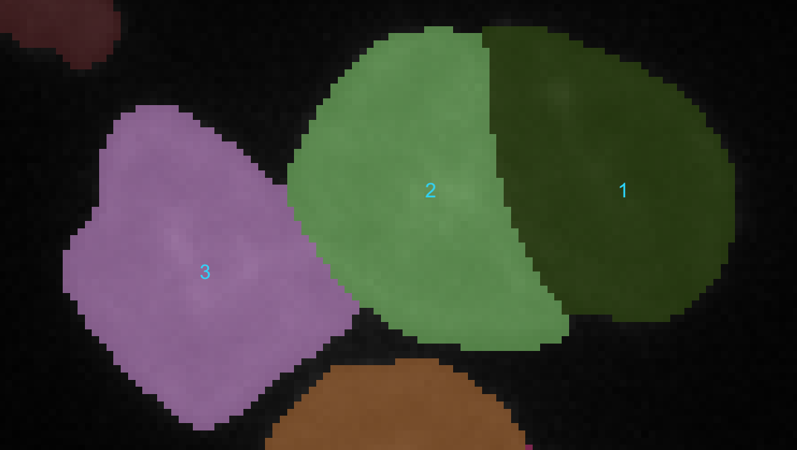
<p><em>Zoomed image - last frame</em></p>
</div>

The first step is to hide the mask and move through earlier frames. This helps confirm whether the model has found real cells or created tracking mistakes.

<div align="left">
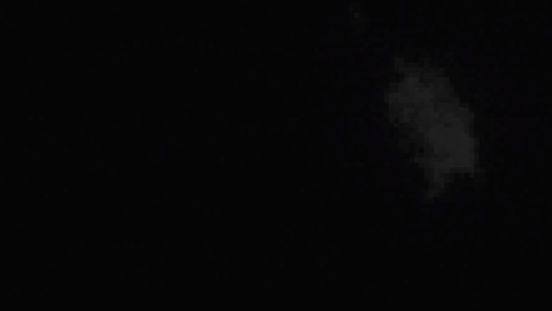
<p><em>Cell 1 appearance - stops at frame 79</em></p>
</div>

<div align="left">

<p><em>Cell 2 appearance - starting from frame 80</em></p>
</div>

A second platelet appears attached to the first but remains distinct. The protrusions around the new cell are filopodia, and their direction helps identify which cell they belong to.

<div align="left">
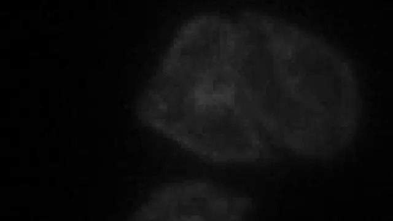
<p><em>Cell 3 appearance - starting from frame 163</em></p>
</div>

### 3.3 Common Model Errors to Fix

Look for these problems while reviewing the prediction:

- ID switching: the same cell changes label ID between frames
- Cell merging: multiple cells are grouped as one object
- Missing cells: a real cell is not detected
- False positives: the model predicts a cell that does not exist
- Over-segmentation: one cell is split into multiple labels
- Duplicate labels: disconnected cells share the same ID

Example of multiple tracking and segmentation errors:

<div align="left">
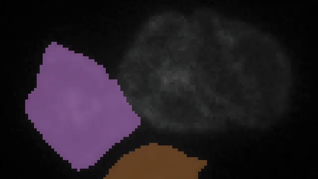
<p><em>Multiple errors in a few frames</em></p>
</div>

### 3.4 Recommended First-Pass Cleanup

Do a rough correction pass before spending time on pixel-perfect boundaries.

1. Select the most frequent ID for each real cell.
2. Move frame by frame from the start of the series.
3. Replace incorrect IDs using fill, merge, or brush tools.
4. Remove merged or false-positive regions with the eraser.
5. Leave difficult missing-cell details for the detailed pass.
6. Confirm every real cell has a unique ID.

In the custom software, `Masks -> Repair and Normalize IDs` can help repair inconsistent IDs and duplicate disconnected same-label regions across the stack.

### 3.5 Contour Precision

Cell boundaries should follow the visible membrane as closely as possible. Include real cell protrusions, but exclude background noise and imaging artifacts.

For rounded contours, do not cut corners or over-smooth the edge. Every included pixel should match the biological structure visible in the image.

<table>
<tr>
<td align="center">
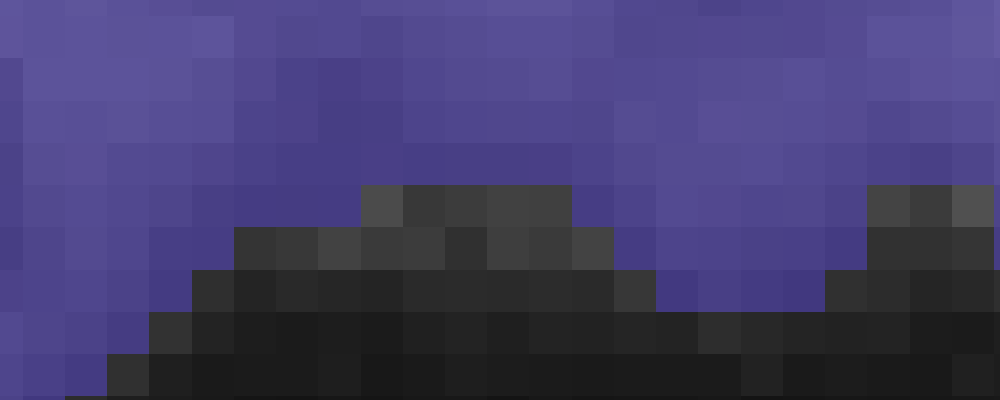<br/>
<em>Incorrect: contour is not properly defined</em>
</td>
<td align="center">
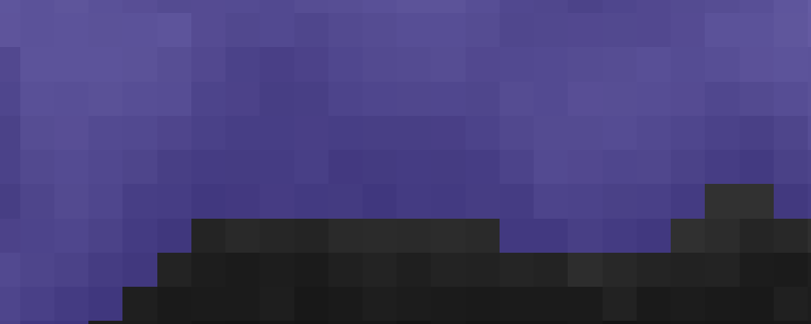<br/>
<em>Correct: contour follows the cell boundary</em>
</td>
</tr>
</table>

### 3.6 Filopodia Rules

Filopodia are thin protrusions that point toward the center of their parent platelet. They are important for deciding how many cells are present and which structure belongs to which cell.

Follow three rules:

- Keep filopodia width consistent along the structure.
- Extend the annotation all the way to the visible tip.
- Clearly define the base where the filopodium meets the cell body.

<table>
<tr>
<th align="center">Incorrect</th>
<th align="center">Image</th>
<th align="center">Correct</th>
</tr>
<tr>
<td align="center">
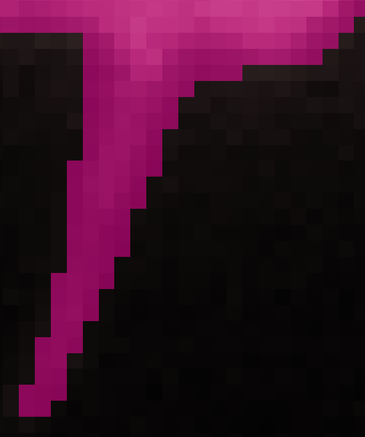<br/>
<em>Width is not consistent</em>
</td>
<td align="center">
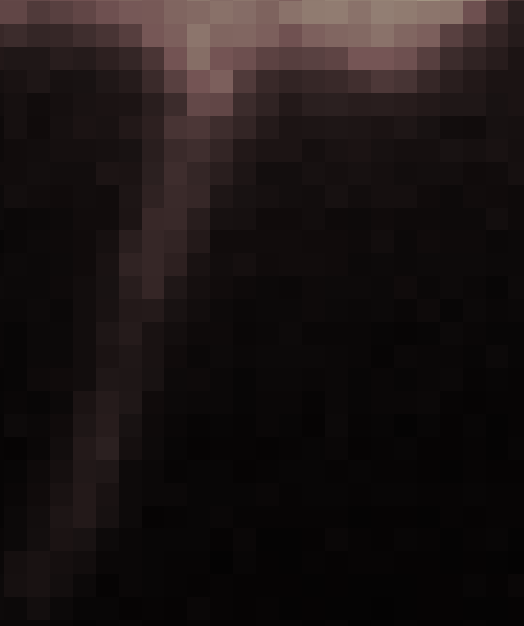<br/>
<em>Original</em>
</td>
<td align="center">
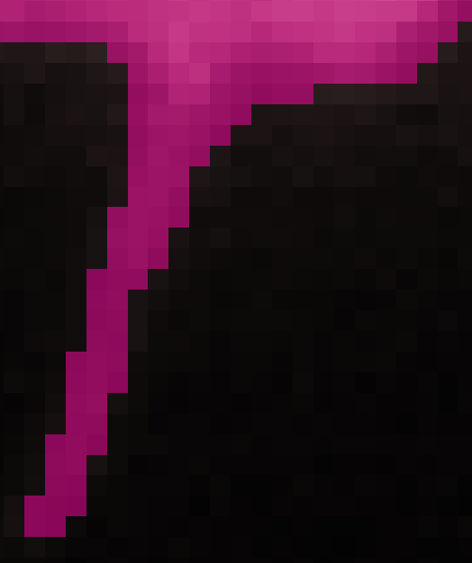<br/>
<em>Consistent width</em>
</td>
</tr>
<tr>
<td align="center">
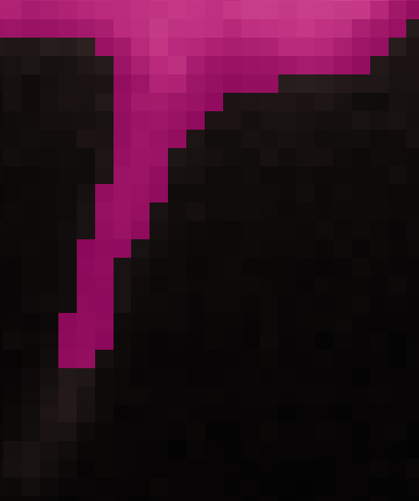<br/>
<em>Tip is not fully annotated</em>
</td>
<td align="center">
<br/>
<em>Original</em>
</td>
<td align="center">
<br/>
<em>Annotation reaches tip</em>
</td>
</tr>
<tr>
<td align="center">
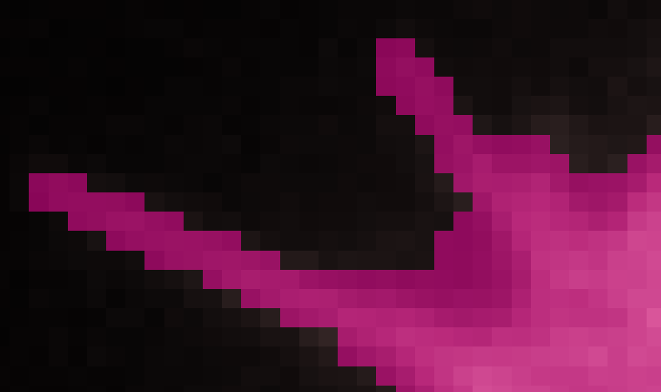<br/>
<em>Base is not well defined</em>
</td>
<td align="center">
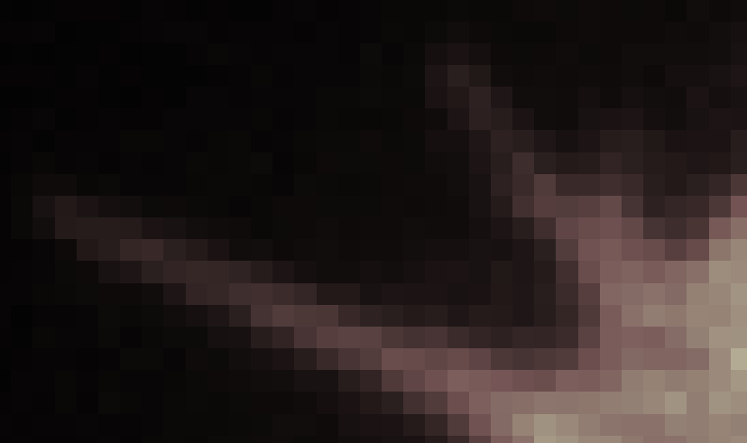<br/>
<em>Original</em>
</td>
<td align="center">
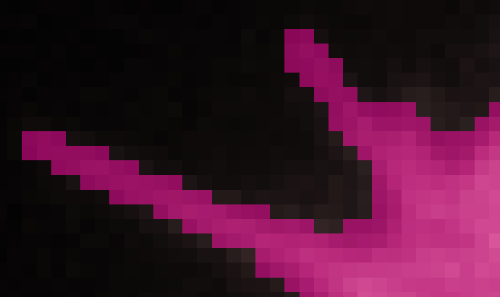<br/>
<em>Base is well defined</em>
</td>
</tr>
</table>

### 3.7 Filopodia Direction and Cell Count

A still image can make one cell look like several separate structures. Use the time series and filopodia direction to decide the true cell count.

<div align="left">
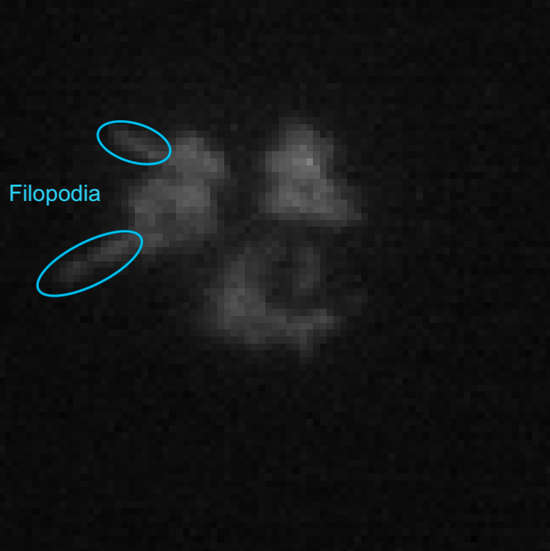
<p><em>Static image - may look like multiple separate cells</em></p>
</div>

The temporal sequence shows the protrusions pointing toward one parent cell:

<div align="left">

<p><em>Time sequence showing filopodia dynamics and direction</em></p>
</div>

Correct annotation:

<div align="left">
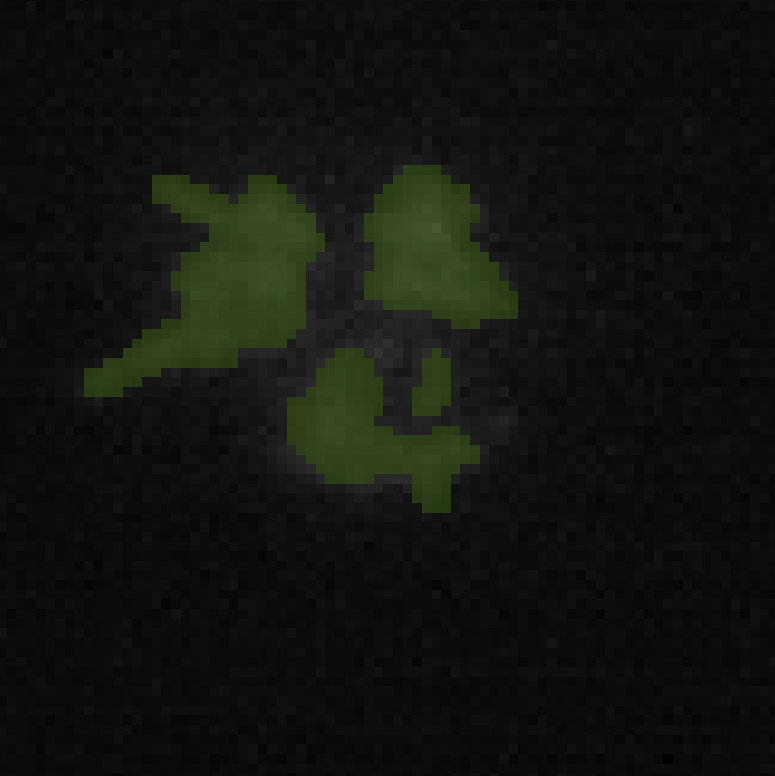
<p><em>Single cell mask based on filopodia direction</em></p>
</div>

Another example where filopodia direction helps identify three distinct cells:

<div align="left">
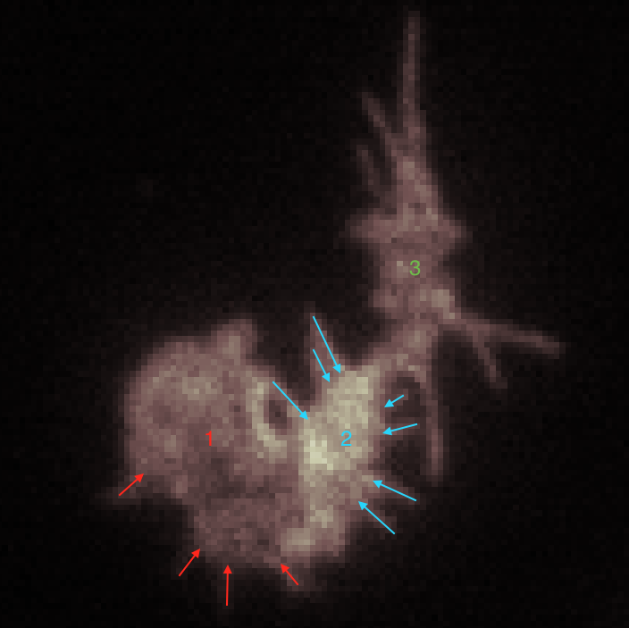
<p><em>Three distinct cells identified using filopodia direction</em></p>
</div>

### 3.8 Overlap and Spatial Priority

When cells overlap visually, the cell that appeared first should maintain spatial priority. Once the priority is established, keep the boundary stable across frames.

<div align="left">

<p><em>Cell overlap sequence showing temporal appearance order</em></p>
</div>

<table>
<tr>
<td align="center">
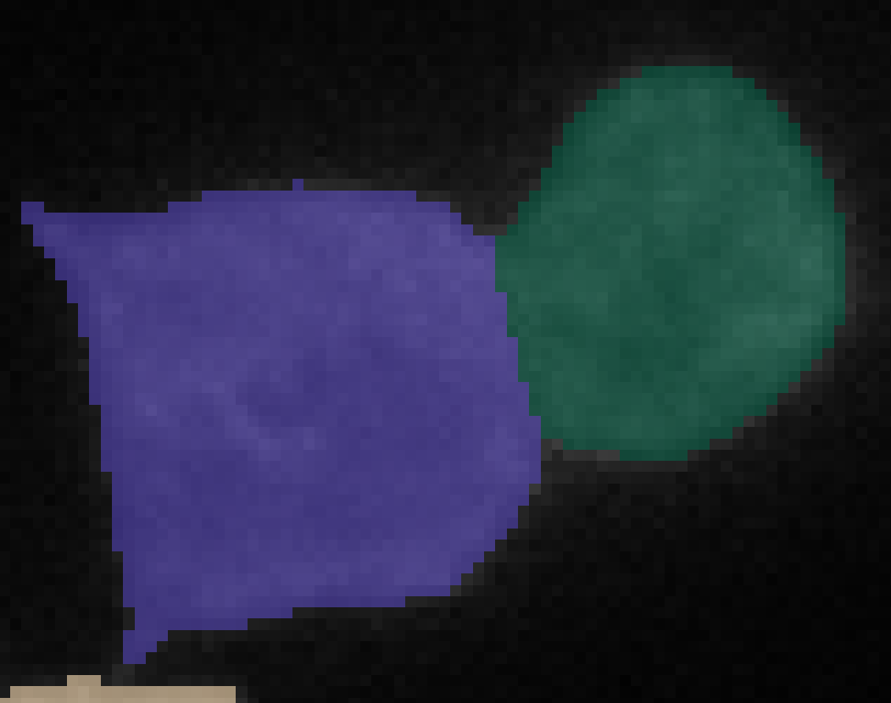<br/>
<em>Correct: first cell has priority</em>
</td>
<td align="center">
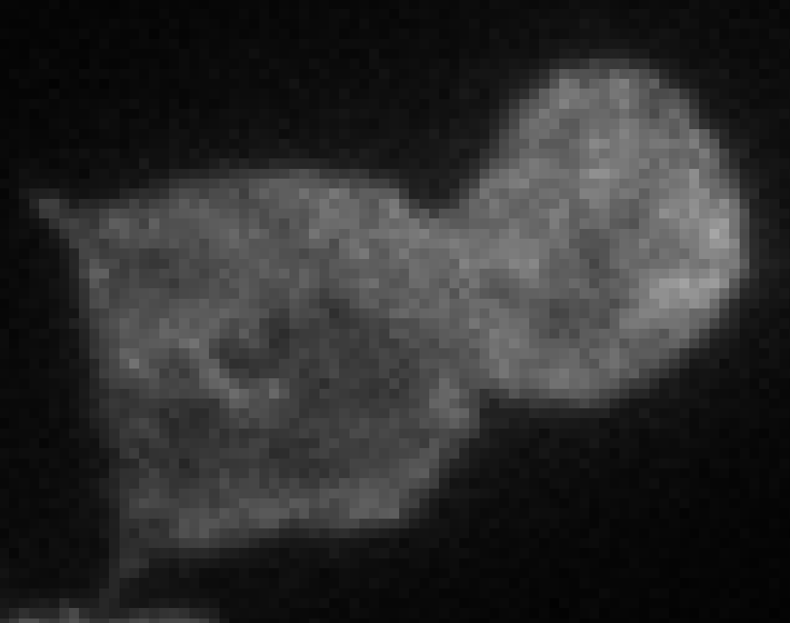<br/>
<em>Original image</em>
</td>
<td align="center">
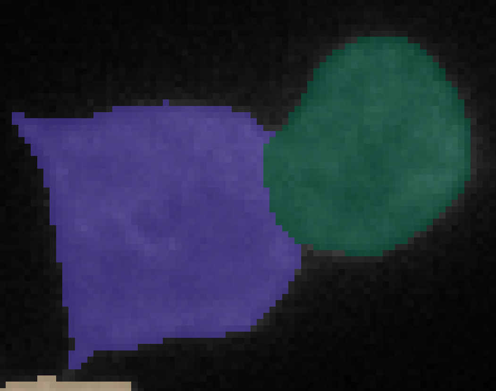<br/>
<em>Incorrect: priority rule violated</em>
</td>
</tr>
</table>

The boundary between overlapping cells should remain stable. Avoid temporal jitter where the mask boundary moves back and forth between frames.

<table>
<tr>
<td align="center">
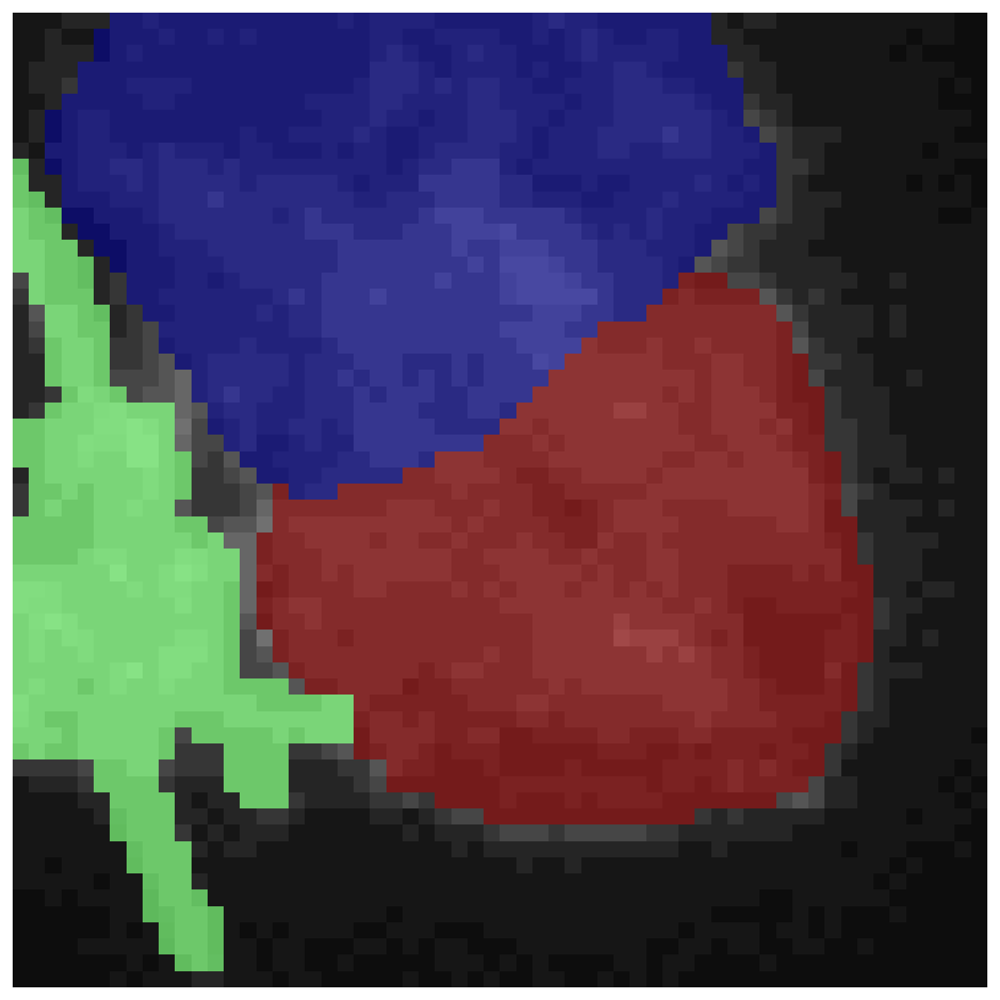<br/>
<em>Correct: stable boundaries over time</em>
</td>
<td align="center">
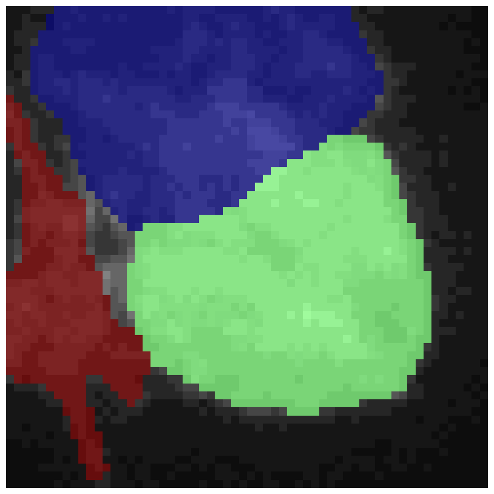<br/>
<em>Incorrect: fluctuating boundaries over time</em>
</td>
</tr>
</table>

### 3.9 Holes and Gaps

There are two common cases:

- Central holes inside the cell body should usually be filled as part of the cell mask.
- Gaps between filopodia or adjacent cells should stay as background.

Use the time series when the choice is unclear.

<table>
<tr>
<td align="center">
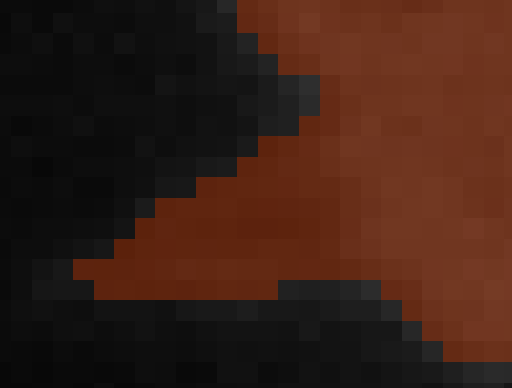<br/>
<em>Incorrect: gap between filopodia is filled</em>
</td>
<td align="center">
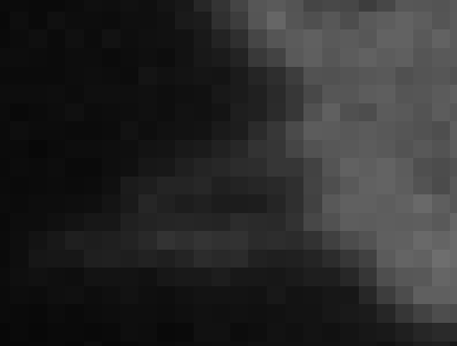<br/>
<em>Original image</em>
</td>
<td align="center">
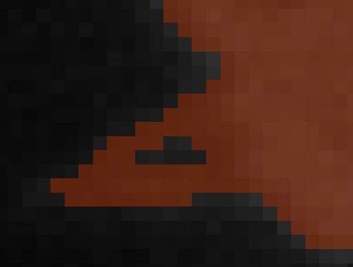<br/>
<em>Correct: gap is preserved as background</em>
</td>
</tr>
</table>

### 3.10 Final Quality Checklist

Before saving a finished mask stack, check that:

- Each real platelet has one unique ID.
- The same platelet keeps the same ID across frames.
- No two disconnected cells share the same ID in the same frame.
- Cell boundaries follow the visible membrane.
- Filopodia are assigned to the correct parent cell.
- Overlapping-cell boundaries remain stable across time.
- False positives are removed.
- Missing cells are annotated as soon as they become visible.
- The saved file is a new `.npz` mask stack.

---

## 4. How to Use the Custom Annotation Software

This section starts with the shortest path to a usable annotation session. The detailed tool behavior is kept lower down for reference.

### 4.1 Start Here: 60-Second Workflow

1. Launch `main.exe`.
2. Load your `.tif` image stack and `.npz` mask using drag and drop or `File -> load`.
3. Turn on both `Mask` and `Tif`.
4. Set `ColorMap` to `BONE` and enable `Normalize` if the image is hard to see.
5. Turn on `Show Cell IDs` when checking tracking consistency.
6. Use the frame slider or arrow keys to move through the time series.
7. Select the label ID you want to edit, or use `Eyedropper` to pick one from the mask.
8. Use `Pen`, `Eraser`, `Fill`, `Merge`, `Split`, or `Polygon` to correct the mask.
9. Use `multi-editor` when the same correction should apply across a frame range.
10. Save regularly with `Ctrl + S` or `File -> save`.

If the imported mask has unstable IDs, run `Masks -> Repair and Normalize IDs` before doing detailed boundary cleanup.

### 4.2 Main Interface Screenshot

<div align="left">
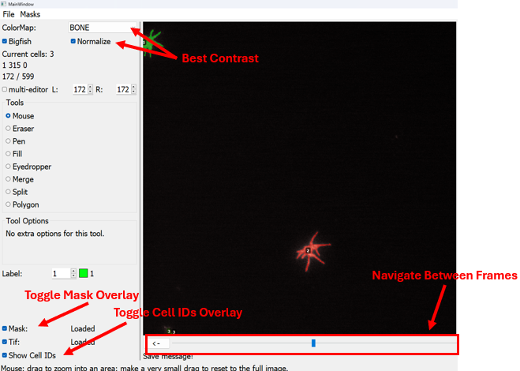
<p><em>Main custom software interface with image stack, mask overlay, display controls, tools, and frame navigation visible.</em></p>
</div>

### 4.3 Controls Cheat Sheet

#### Display and Navigation

| Control | What it does | Typical use |
|---------|--------------|-------------|
| `File -> load` | Loads image and mask files | Use if drag and drop is inconvenient |
| Drag and drop | Loads files into the app window | Fastest way to load `.tif` and `.npz` files |
| `ColorMap` | Changes the image colormap | Use `BONE` as a good default |
| `Normalize` | Rescales the current frame for higher contrast | Turn on when cells are hard to see |
| `Bigfish` | Shows the app's rescaled high-contrast image stack | Useful for contrast-heavy inspection |
| `Mask` | Shows or hides the mask overlay | Toggle while checking boundaries |
| `Tif` | Shows or hides the raw image | Keep on for most annotation work |
| `Show Cell IDs` | Draws label IDs inside connected mask regions | Use to find duplicate labels and ID switches |
| Frame slider | Moves through the time series | Use for temporal consistency checks |
| Left/right arrows | Moves one frame backward or forward | Faster frame-by-frame review |

#### Label and Cursor Information

The left panel shows the current cell count, frame index, and cursor information in the format `x y label`. When no mask is loaded, the label field shows `-` while hovering.

<div align="left">
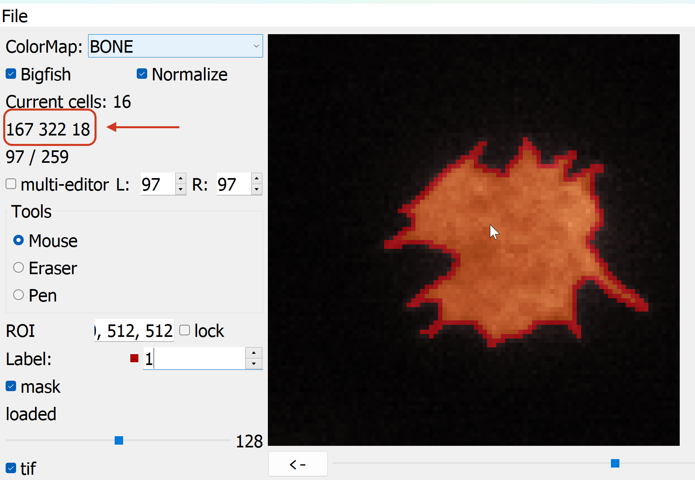
<p><em>Label information panel showing cursor coordinates and cell ID</em></p>
</div>

The label section lets you select the target label ID used by editing tools, preview that label's display color, and see the formatted label text for the selected ID. `Eyedropper` can also set the current label directly from an existing mask region.

#### Tool Selection

<div align="left">
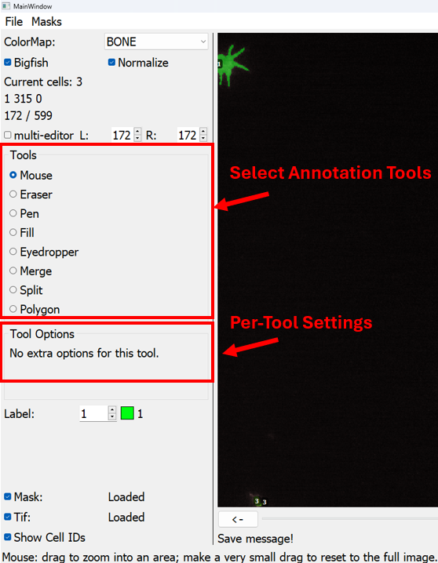
<p><em>Tool panel and tool options used for mask cleanup.</em></p>
</div>

| Tool | Use it when you need to | Main note |
|------|--------------------------|-----------|
| `Mouse` | Pan or reset the working view | Draw a selection rectangle over the image |
| `Pen` | Add pixels to the selected cell label | Uses a square brush |
| `Eraser` | Remove mask pixels | Paints label `0` |
| `Fill` | Replace one connected region with the selected label | Can work across a multi-editor range |
| `Eyedropper` | Select an existing label from the mask | Background clicks do not change the selected label |
| `Merge` | Combine two labels | Click the label to keep, then the label to merge into it |
| `Split` | Divide one mask region into two labels | Current frame only |
| `Polygon` | Relabel an enclosed area | Useful for shaped corrections |
| `multi-editor` | Apply edits across several frames | Uses the selected `L` to `R` frame range |

### 4.4 Common Tasks

| Task | Best tool or control | Workflow |
|------|----------------------|----------|
| Load data | Drag and drop or `File -> load` | Load the `.tif` image stack and `.npz` mask stack |
| Improve visibility | `ColorMap`, `Normalize`, `Mask`, `Tif` | Use `BONE`, enable `Normalize`, and keep both `Mask` and `Tif` visible |
| Choose a label | Label input or `Eyedropper` | Enter the label ID manually or click an existing region with `Eyedropper` |
| Fix the wrong ID on a region | `Fill` | Select the correct label, then click the incorrectly labeled connected region |
| Remove a false positive | `Eraser` or right-click `Delete` | Erase the region or delete the selected mask region |
| Add missing pixels | `Pen` | Select the correct label and paint the missing area |
| Merge duplicate labels | `Merge` | Click the label to keep, then click the label to merge into it |
| Split a merged cell | `Split` | Drag a line through the merged region; a new free label ID is assigned |
| Relabel an irregular area | `Polygon` | Place polygon points, then close the polygon near the first point |
| Apply the same fix across frames | `multi-editor` | Enable it, set `L` and `R`, then use supported tools |
| Save your work | `Ctrl + S` or `File -> save` | A new timestamped compressed `.npz` file is written |

### 4.5 Multi-Editor and Batch ID Repair

`multi-editor` applies supported edits across a frame range.

<div align="left">
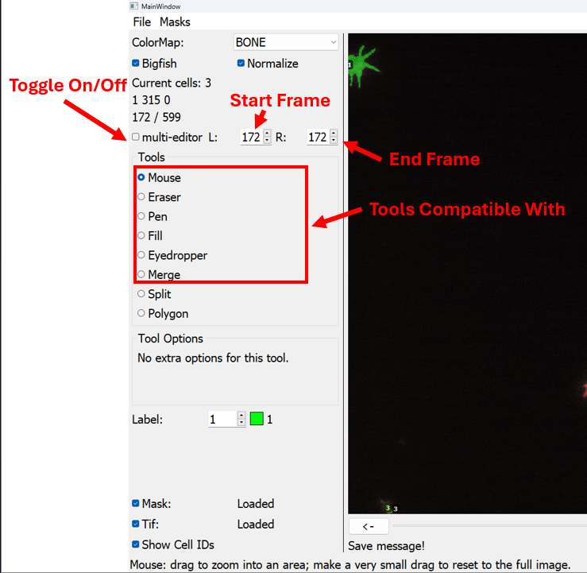
<p><em>Multi-editor controls for applying supported edits across the selected frame range.</em></p>
</div>

| Control | Meaning |
|---------|---------|
| `multi-editor` | Enables or disables range editing |
| `L` | Left frame index |
| `R` | Right frame index |

Supported multi-editor actions:

- Brush editing
- Fill
- Merge

Split is always limited to the current frame and temporarily disables multi-editor while active. Polygon currently applies to the current frame only. If multi-editor is off, `L` and `R` follow the current frame automatically.

The top menu also includes `Masks -> Repair and Normalize IDs`. Use this when the same cell flips between different IDs, or when two disconnected cells were given the same label in one frame.

<div align="left">
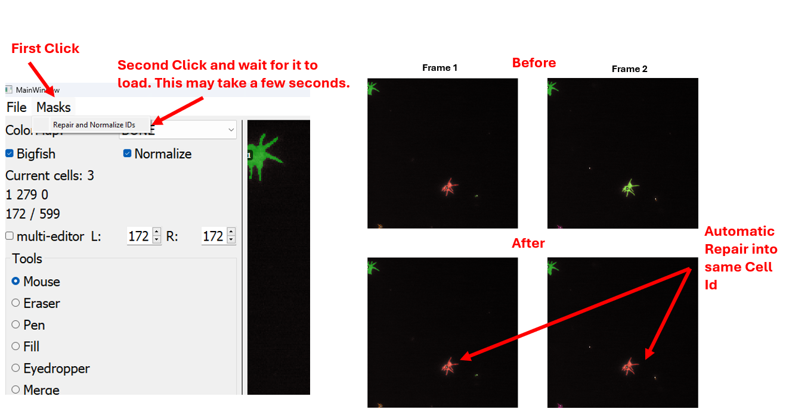
<p><em>Repair and Normalize IDs menu action for fixing ID switches and duplicate disconnected same-label regions.</em></p>
</div>

This action relabels the full mask stack without changing mask shapes. It tracks connected regions across frames, keeps one consistent ID per cell when possible, repairs duplicate disconnected same-label regions, and runs as a single undoable operation.

Tip: turn on `Show Cell IDs` before or after running this action to quickly inspect whether IDs are now stable across frames.

### 4.6 Detailed Tool Reference

<details>
<summary>Display, status, and file loading details</summary>

Load data in either of these ways:

1. Drag and drop files into the application window.
2. Use `File -> load`.

You can load a single-channel image stack (`.tif`) and an initial mask stack (`.npz`). For most annotation tasks, load both files.

When both `Mask` and `Tif` are enabled, the software overlays the label mask on top of the image. When `Show Cell IDs` is enabled, disconnected regions that share the same label are each annotated in place, which makes duplicate-label problems easier to spot.

The left panel shows:

- Current cell count for the active frame
- Cursor position and label under the cursor in the format `x y label`
- Current frame index

Frame navigation is available through the left and right arrow buttons under the image, the frame slider, and keyboard left and right arrows.

</details>

<details>
<summary>Tool behavior details</summary>

#### Mouse

Use `Mouse` mode to pan your working area by drawing a selection rectangle over the image. If the selection is too small, the view resets to the full image extent.

#### Eraser

Use `Eraser` to paint label `0` into the mask with a square brush. The main option is `Tool size`.

#### Pen

Use `Pen` to paint the currently selected label ID into the mask with a square brush. The main option is `Tool size`.

#### Fill

`Fill` flood-fills the clicked connected region with the selected label. It applies to one frame when multi-editor is off and across the selected frame range when multi-editor is on.

#### Eyedropper

`Eyedropper` samples the clicked mask label and sets it as the active label. Clicking background does not change the selected label.

#### Merge

`Merge` combines one label into another. Click the label you want to keep, then click the second label you want to merge into it. It works on the current frame by default and can apply across the selected multi-editor frame range.

#### Split

`Split` divides a mask region using a drawn line and assigns a new free label ID.

1. Select `Split`.
2. Click and drag across the object to define the split line.
3. Release the mouse to apply the split.

Split uses the current brush size as the split thickness, works on the current frame only, and disables multi-editor while active.

#### Polygon

`Polygon` applies the selected label inside a user-defined polygon.

1. Select `Polygon`.
2. Left-click to place polygon points.
3. Move near the first point to close and apply the polygon.
4. Right-click to cancel the polygon in progress.

Options:

- `Close distance`: how close the cursor must be to the first point to close the polygon
- `Preview outline`: shows or hides the live polygon overlay
- `Fill holes`: fills internal holes in the polygon region
- `Apply to`: `Background only`, `Existing masks only`, or `Both`

Current safeguards:

- Self-intersecting polygons are rejected.
- By default, polygon fill does not overwrite neighboring labels unless `Apply to` is set to `Both`.

</details>

<details>
<summary>Context menu, zoom, saving, and undo details</summary>

Right-clicking in the image view opens a context menu with:

- `Copy`
- `Paste`
- `Delete`

These actions operate on mask regions and are useful for quick local corrections.

Mouse wheel behavior:

- `Scroll Wheel`: changes brush size
- `Ctrl + Scroll Wheel`: zooms in or out around the cursor position

The brush is square-shaped. Brush size changes affect `Pen`, `Eraser`, and `Split`.

Saving:

- Use `Ctrl + S` or `File -> save`.
- Masks are saved as compressed `.npz` files.
- The save filename includes a timestamp.
- Saving writes a new file rather than silently overwriting the original.

Undo:

- Use `Ctrl + Z`.
- The application keeps a limited undo history of recent committed edits.

</details>

### 4.7 Keyboard Shortcuts

| Shortcut | Function |
|----------|----------|
| `Ctrl + S` | Save current mask stack |
| `Ctrl + Z` | Undo last committed edit |
| `Ctrl + M` | Toggle multi-editor |
| `Ctrl + E` | Select Eraser |
| `Ctrl + P` | Select Pen |
| `Ctrl + F` | Select Fill |
| `Left Arrow` | Previous frame |
| `Right Arrow` | Next frame |
| `Scroll Wheel` | Change brush size |
| `Ctrl + Scroll Wheel` | Zoom image |

---

## 5. How to Use Napari

### 5.1 Launch Napari

Activate the environment:

```bash
conda activate annotation
```

Launch Napari:

```bash
napari
```

A window like this should appear:

<div align="left">
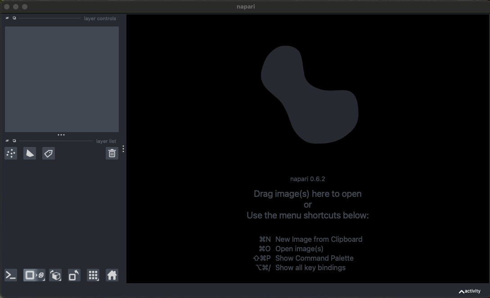
</div>

### 5.2 Load the Image and Mask

You should receive:

- A grayscale image stack (`.tif`)
- An initial mask stack (`.npz`)

Drag and drop both files into the Napari interface.

<div align="left">
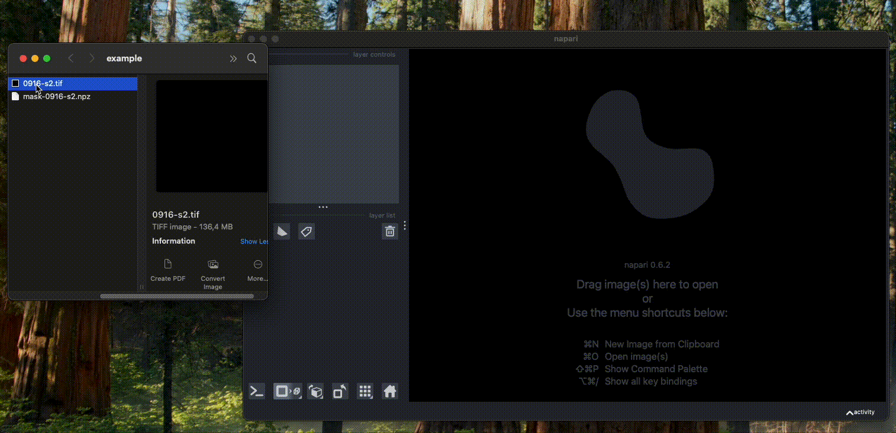
</div>

Make sure the mask layer is above the image layer in the layer list on the left side of the interface. You can reorder layers by dragging them vertically.

### 5.3 Select the Mask Layer

Select the mask layer before editing. The most-used label tools are in the top-left controls:

<table>
<tr>
<td style="vertical-align: top;">
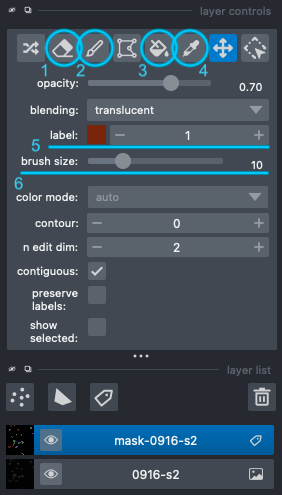
</td>
<td style="vertical-align: top;">
<ol>
<li><strong>Label eraser:</strong> removes labels from the current image.</li>
<li><strong>Paint brush:</strong> paints the selected ID on the current image.</li>
<li><strong>Fill bucket:</strong> replaces the clicked ID and all adjacent pixels with the selected ID.</li>
<li><strong>Pick mode:</strong> selects the clicked ID.</li>
<li><strong>Label selector:</strong> manually sets the painting ID and shows its color.</li>
<li><strong>Brush size:</strong> changes the brush size.</li>
</ol>
</td>
</tr>
</table>

### 5.4 Navigate Frames

Use the frame slider at the bottom of the window to move through the image series.

<div align="left">
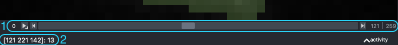
</div>

Useful navigation details:

- The frame slider changes the active image frame.
- The left and right arrows can move between frames.
- Pointer information is shown in the format `[Frame Height Width]`.
- The final value outside the brackets is the label under the cursor, when the mask layer is selected.

### 5.5 Napari Annotation Workflow

1. Load the `.tif` image stack and `.npz` mask stack.
2. Put the mask layer above the image layer.
3. Select the mask layer.
4. Hide and show the mask while checking the raw image.
5. Use the frame slider to understand when each platelet appears.
6. Use pick mode to sample existing IDs.
7. Use fill for larger connected-region ID corrections.
8. Use brush and eraser for detailed boundary cleanup.
9. Keep IDs stable across the time series.
10. Save the edited mask using Napari's save selected layer action, then confirm the output format matches the required project deliverable.

If you need compressed `.npz` output exactly like the custom software saves, confirm the expected save/export step before doing the final annotation pass in Napari.

---
## 6. Building the App

This repository includes simple build entrypoints for both Windows and macOS.

### 6.1 Windows Build

Recommended steps from the project root:

```powershell
py -3 -m venv .venv
.venv\Scripts\Activate.ps1
py -3 -m pip install --upgrade pip
py -3 -m pip install pyinstaller pyqt5 pillow numpy opencv-python-headless
.\build_windows.ps1
```

Output:

- `dist\main\main.exe`

Note:

- This is a folder-style PyInstaller build, so distribute the whole `dist\main\` folder, not only the `.exe`.

### 6.2 macOS Build

Build this on a Mac from the project root:

```bash
python3 -m venv .venv
source .venv/bin/activate
python3 -m pip install --upgrade pip
python3 -m pip install pyinstaller pyqt5 pillow numpy opencv-python-headless
chmod +x build_macos.sh
./build_macos.sh
```

Output:

- `dist/main.app`

Notes:

- macOS apps should be built on macOS rather than cross-compiled from Windows.
- If you plan to share the app outside your own machine, you may later want to add code signing and notarization.
