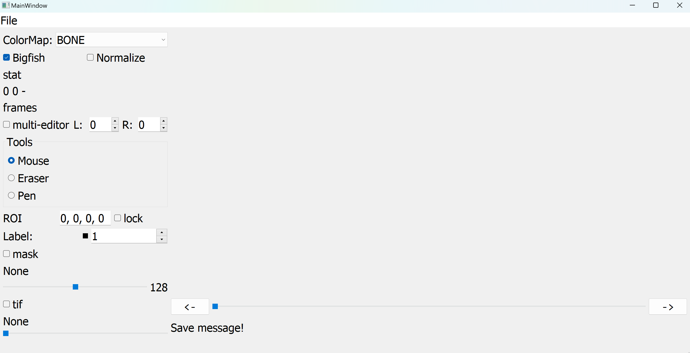

# Platelets Segmentation and Tracking 🔬 - Images Annotation

This repository provides a comprehensive guide for annotating platelet cells in microscopy images using Napari, creating high-quality ground truth masks for segmentation and tracking models.

## Table of Contents
1. [Getting Started](#1-getting-started-)
   - [1.1 Installation Options](#11-installation-options-)
   - [1.2 Choosing Your Installation Method](#12-choosing-your-installation-method)
2. [Annotation Workflow](#2-annotation-workflow-)
3. [Examples](#3-examples-)
4. [Custom Annotation Software Instructions](#4-custom-annotation-software-instructions-windows-only-)

---

## 1. Getting Started 🚀

### 1.1 Installation Options 🔧

To annotate images, you have **two software options** to choose from: either **Napari** (an interactive viewer for multi-dimensional images in Python) or our **custom annotation software** designed specifically for platelet segmentation (Windows only).

#### Option A: Standard Napari Installation (Cross-platform) 🐍

Follow this option if you want to install Napari using Python/Anaconda. This method works on Windows, macOS, and Linux.

1. **Install Anaconda** 📦  
   Download and install the [Anaconda distribution](https://www.anaconda.com/download).

2. **Restart your computer** 🔄  
   This ensures Anaconda is properly installed and recognized by your system.

3. **Create a new Conda environment** 🐍  
   Open a new terminal and run:
```bash
conda create -n annotation python=3.11
```

4. **Activate the environment** ⚡  
```bash
conda activate annotation
```

5. **Install Napari and dependencies** 📸  
```bash
conda install -c conda-forge napari pyqt
```

6. **Verify the installation** ✅  
```bash
napari --version
```

You should see something like: *napari version X.X.X*

#### Option B: Custom Annotation Software (Windows Only) 💻

**⚠️ Windows Users Only**: For a specialized annotation experience, you can use our custom-built annotation software designed specifically for platelet segmentation tasks.

1. **Download the project** 📁
   - Go to the [GitHub repository](https://github.com/QIAN-SU-Lab/Platelet-Segmentation-Annotation)
   - Download the complete project as ZIP or clone it

2. **Locate the custom software** 🔍
   - Navigate to the `label software/` folder in the downloaded project
   - Find the custom annotation software executable (`main.exe` file)

3. **Launch the software** 🚀
   - Double-click the executable to launch the custom annotation tool
   - No additional installation required

**Note:** This custom software is specifically designed for platelet annotation workflows and provides a different interface and feature set compared to standard Napari. It includes specialized tools optimized for platelet segmentation tasks.
**⚠️ Important:** The custom annotation software offers a more streamlined and specialized interface for platelet annotation compared to Napari. While it is not as polished and may be harder to use, its focused design makes it particularly well-suited for efficient and accurate platelet segmentation tasks.

### 1.2 Choosing Your Installation Method

If you are on **macOS** or **Linux**, use **Option A (Napari)**.  
If you are on **Windows**, you can use either **Option A (Napari)** or **Option B (Custom Software)**.

**⚠️ Important Note:** The two options offer different interfaces and workflows. The remainder of this documentation focuses on the Napari-based approach (Option A). If you choose to use the custom software (Option B), please refer to the final section of this document for instructions specific to that tool. Regardless of your choice, you should still follow the annotation principles and detailed steps outlined in the following sections, as they apply to both tools. 

---

## 2. Annotation Workflow 🔬

### 2.1 Overview

The objective is to create a precise mask over the cells. This mask is called "ground truth" (GT) and can be used for evaluating segmentation models or directly for training deep learning models.

It is essential to apply meticulous attention to mask creation, as we are looking for the finest details in the image, especially precise contours.

<table>
<tr>
<td align="center">
<br/>
<em>Original grayscale image (.tif)</em>
</td>
<td align="center">
<br/>
<em>Expected mask (.npz)</em>
</td>
</tr>
</table>

### 2.2 Getting Started with Napari

If your environment is not activated, use the following command:
```bash
conda activate annotation
```

To launch **Napari**, execute:
```bash
napari
```

A window like this should appear:

<div align="left">

</div>

To annotate an image, you will receive:
- A grayscale format image (.tif)
- An initial mask (.npz) to optimize

Start by dragging and dropping these two files into the Napari interface.

<div align="left">

</div>

Make sure the mask is above the image in the layer list (on the left side of the Napari interface). You can vertically reorganize the layer list by dragging them.

### 2.3 Annotation Controls

Start by selecting the mask in the layer list. Let's focus on the controls located on the top left side of the interface. Here is the list of the most used tools when annotating images:

<table style="border: none; border-collapse: collapse;">
<tr>
   <td style="border: none; vertical-align: top;">
      
   </td>
   <td style="border: none; vertical-align: top;">
   <ol style="margin-top: 0; padding-top: 0;">
      <li><b>Label eraser:</b> A brush to remove all IDs from the current image.</li>
      <li><b>Paint brush:</b> A brush to paint the selected ID on the current image.</li>
      <li><b>Fill bucket:</b> Replaces the clicked ID and all adjacent pixels with the selected ID.</li>
      <li><b>Pick mode:</b> Selects the clicked ID.</li>
      <li><b>Label selector:</b> Allows you to manually set the painting ID (displays the paint color)</li>
      <li><b>Brush size:</b> Modifies the brush size.</li>
   </ol>
   </td>
</tr>
</table>

### 2.4 Navigation Between Frames 🎬

You can use the frame slider at the bottom of the GUI to navigate between frames and get pointer-related information.

<div align="left">
   
</div>

**1 - Frame slider**: Allows navigation between different images in the series. You can also click the arrows or use the left and right arrows on your keyboard. ⬅️➡️

**2 - Pointer information**: Shows your pointer coordinates in the format [Frame Height Width] (height and width in pixels). The last digit (outside of the brackets) corresponds to the label you are currently pointing at (if none, the mask is not selected in the layer list).

### 2.5 Creating Ground Truth Masks

We will focus on a specific case of 3 adjacent cells to understand how to properly create the ground truth mask.

<div align="left">
   
   <p><em>Zoomed image - last frame</em></p>
</div>

#### 2.5.1 Step 1: Determine the Actual Number of Cells 🔍

The first step is to identify whether there are actually 3 cells, or if the model made an error. To do this, we start by hiding the mask layer. We use the frame slider to go back to the appearance of these cells.

<div align="left">
   
   <p><em>Cell 1 appearance - stops at frame 79</em></p>
</div>
<div align="left">
   
   <p><em>Cell 2 appearance - starting from frame 80</em></p>
</div>

We can clearly observe that a second cell appears, attached to the first but distinct. Such spontaneous appearance can indicate this. Additionally, when cell 2 appears, we can see protrusions forming around the new cell. These are called **filopodia**. 🦠

> **Important note:** Filopodia point toward the center of the cell. 🎯

We can therefore be certain that two cells exist starting from frame 80. Similarly, we can see in the following animation the appearance of the 3rd cell.

<div align="left">
   
   <p><em>Cell 3 appearance - starting from frame 163</em></p>
</div>

#### 2.5.2 Step 2: Identifying Model Errors and Corrections ⚠️

Common model inconsistencies include:
- **ID switching:** Changes cell IDs from one image to another (tracking errors)
- **Cell merging:** Groups multiple cells into one across some or all images
- **Missing cells:** Fails to detect existing cells
- **False positives:** Predicts cells that don't exist
- **Over-segmentation:** Predicts multiple cells where only one exists

⚠️ **Warning:** There are cases where the model predicts a single cell across all frames when multiple cells actually exist. It's important to detect this by understanding filopodia orientation.

**Example of errors:**

<div align="left">
   
   <p><em>Multiple errors in a few frames</em></p>
</div>
In this example, the base prediction has many ID changes, loses cell tracking, and sometimes merges cells 1 and 2.

#### 2.5.3 Step 3: Preliminary Correction Workflow

It is essential to perform preliminary work to assign a unique ID to each cell throughout the time series.

Correction procedure:
1. **Select the most frequent ID** for each cell by observing which ID appears most often for that specific cell across frames.
2. **Navigate frame by frame** starting from the beginning and replace incorrect predictions using the **Fill bucket** tool.
3. **Skip frames without predictions** - ignore these frames as you will rework this part later during detailed annotation.
4. **Handle merged cells** - if the model fuses multiple cells together, use the **Label eraser** to remove all erroneous masks.

By reviewing all images systematically, we can eliminate the model's gross errors and fill in the gaps during the second step of detailed annotation.

⚠️ **Important:** Each cell must have a different unique ID. When manually choosing an ID, ensure it's not already used by another cell.

#### 2.5.4 Step 4: Detailed Annotation

This is the most demanding phase requiring extreme precision. Focus on capturing fine details, especially accurate contours and filopodia. This step involves refining the preliminary masks to achieve pixel-perfect accuracy.

##### 2.5.4.1 Essential Annotation Rules

**📏 Contour Precision Rule**
- Cell boundaries should follow the actual cell membrane as closely as possible
- Include all visible cell protrusions
- Exclude background noise and imaging artifacts

**🎯 Filopodia Direction Rule**
- Filopodia always point toward their parent cell's center
- Use this to resolve ambiguous cases about cell count or filopodia ownership
- Filopodia have the same thickness within a single platelet

**🔒 Spatial Priority Rule**
- When cells visually overlap: the cell that appeared first maintains spatial priority
- Maintain consistent priority throughout the time series

**🕳️ Holes in Cells Rule**
- Occasionally, a 'hole' may be visible within a cell.
- If the hole is located at the center of the cell, it should be ignored during annotation and not included in the mask (ie colored).
- If the hole appears between two filopodia or between adjacent platelets, it must be explicitly annotated as a background region in the mask.

##### 2.5.4.2 Contour Precision Rule Application

For rounded contours, it is important to select all pixels that precisely correspond to the cell membrane, without including background areas or imaging artifacts. Be sure to follow the natural curvature of the cell, avoiding "cutting" corners or excessively smoothing the edges. Every pixel included in the mask should reflect the biological reality observed in the image. This level of precision is essential to ensure the quality of the annotations and the performance of segmentation models.

<table>
<tr>
<td align="center">
<br/>
<p><em>not properly defined cell contours</em></p>
</td>
<td align="center">
<br/>
<p><em>properly defined cell contours</em></p>
</td>
</tr>
</table>

For filopodia contours (the thin, pointed structures), there are three essential rules to follow:

**A) Consistent Width**  
Filopodia should be annotated with a consistent width along their entire length.

**B) Extend to the Tip**  
The annotation must reach the very end of each filopodium, ensuring no part is omitted.

**C) Clearly Define the Base**  
The base of each filopodium should be precisely separated from the main cell body, avoiding ambiguous boundaries.

Below is a visual summary of these rules. For each case, the left column shows an incorrect annotation, the center displays the original image, and the right column shows the correct annotation:

<table>
   <tr>
      <th align="center">❌ Incorrect</th>
      <th align="center">Image</th>
      <th align="center">✅ Correct</th>
   </tr>
   <tr>
      <td align="center">
         <br/>
         <em>Width not consistent</em>
      </td>
      <td align="center">
         <br/>
         <em>Original</em>
      </td>
      <td align="center">
         <br/>
         <em>Consistent width</em>
      </td>
   </tr>
   <tr>
      <td align="center">
         <br/>
         <em>Tip not fully annotated</em>
      </td>
      <td align="center">
         <br/>
         <em>Original</em>
      </td>
      <td align="center">
         <br/>
         <em>Annotation reaches tip</em>
      </td>
   </tr>
   <tr>
      <td align="center">
         <br/>
         <em>Base not well defined</em>
      </td>
      <td align="center">
         <br/>
         <em>Original</em>
      </td>
      <td align="center">
         <br/>
         <em>Base well defined</em>
      </td>
   </tr>
</table>

##### 2.5.4.3 Filopodia Direction Rule Application

The following example demonstrates the **Filopodia Direction Rule** for determining cell count based on filopodia orientation.

**🤔 Initial Assessment Challenge:**
How many cells do you count in this image?

<div align="left">

<p><em>Static image - appears to show multiple separate structures</em></p>
</div>

**⏱️ Temporal Analysis:**
The initial impression might suggest 3 separate cells, but temporal analysis reveals the true structure:

<div align="left">

<p><em>Time sequence showing filopodia dynamics and direction</em></p>
</div>

**🔍 Key Observation:** When observing the temporal sequence, filopodia consistently point toward the center of a single cell. This directional pattern is the definitive indicator for cell counting and ownership assignment.

**✅ Correct Annotation:**
Based on filopodia direction analysis, the expected mask for the above image is:

<div align="left">

<p><em>✅ Single cell mask based on filopodia direction rule</em></p>
</div>
<br>
Here is another example where you can use filopodia direction to determine the number of platelets:

<div align="left">

<p><em>3 distinct cells, identified thanks to filopodia direction</em></p>
</div>

##### 2.5.4.3 Spatial Priority Rule Application

The following example demonstrates the **Spatial Priority Rule** when two cells overlap. In this sequence, the left cell appears before the right cell.

<div align="left">
   
   <p><em>Cell overlap sequence showing temporal appearance order</em></p>
</div>

**Analysis:** The left cell is present first, then the right cell appears and creates an overlapping region. 

**Correct vs. Incorrect Annotation:**

<table>
<tr>
<td align="center">
<br/>
<em>✅ <strong>CORRECT</strong><br/>First cell has priority</em>
</td>
<td align="center">
<br/>
<em>🔬 <strong>ORIGINAL</strong><br/>Raw microscopy image</em>
</td>
<td align="center">
<br/>
<em>❌ <strong>INCORRECT</strong><br/>Priority rule violated</em>
</td>
</tr>
</table>

**Technical Details:**
- **Correct annotation:** The first cell's mask extends into the overlap region, maintaining spatial continuity
- **Incorrect annotation:** Fails to apply temporal priority, creating inconsistent segmentation boundaries

**🔒 Temporal Stability Requirement:**
An essential aspect of the Spatial Priority Rule is that **the mask boundaries must remain stable over time**. Once the priority between overlapping cells is established, the segmentation boundary should not fluctuate between frames.

<table>
<tr>
<td align="center">
<br/>
<em>✅ <strong>CORRECT</strong><br/>Stable mask boundaries between all cells</em>
</td>
<td align="center">
<br/>
<em>❌ <strong>INCORRECT</strong><br/>Fluctuating mask boundaries over time</em>
</td>
</tr>
</table>

**Key Point:** The boundary between overlapping cells should be consistent across all frames in the time series, preventing temporal jitter in the segmentation masks.


##### 2.5.4.4 Holes in Cells Rule Application

The **Holes in Cells Rule** addresses how to handle gaps or holes that may appear within cell structures during annotation. This rule is critical for maintaining biological accuracy and consistency in ground truth masks.

**🕳️ Two Types of Holes:**

**A) Central Cell Holes** - Ignore and Fill  
If a hole appears in the center of a cell body, it should be **ignored** during annotation and filled with the cell's mask. These are typically imaging artifacts or natural cellular features that should not create gaps in the segmentation.

**B) Filopodia-Created Holes** - Preserve as Background  
If a hole appears between filopodia or between adjacent cell structures, it must be **explicitly preserved** as background (not colored) in the mask. These represent genuine spatial gaps between cellular components.

**Visual Example:**

<table>
<tr>
<td align="center">
<br/>
<em>❌ <strong>INCORRECT</strong><br/>Hole between filopodia filled</em>
</td>
<td align="center">
<br/>
<em>🔬 <strong>ORIGINAL</strong><br/>Clear gap between filopodia</em>
</td>
<td align="center">
<br/>
<em>✅ <strong>CORRECT</strong><br/>Gap preserved as background</em>
</td>
</tr>
</table>

**🎯 Decision Guidelines:**
- **Location matters:** Central holes in cell bodies → Fill them
- **Structure matters:** Gaps between distinct cellular features → Preserve them
- **When in doubt:** Examine the temporal sequence to understand if the gap represents a genuine spatial separation

**Key Principle:** The annotation should reflect the biological reality of cellular boundaries, preserving genuine spatial relationships while avoiding artifacts.


##### 2.5.4.5 Final Annotation Guidelines 🎯

To complete the annotation of an image series, you must systematically process all cells across all frames to obtain a detailed, accurate mask. This comprehensive approach ensures temporal consistency and biological accuracy.

**🔄 Complete Workflow Summary:**
1. **Frame-by-frame review** - Examine every frame in the sequence
2. **Cell tracking** - Maintain consistent IDs for each cell throughout the time series
3. **Detail refinement** - Apply precision annotation to capture fine cellular structures
4. **Quality validation** - Verify annotation consistency across temporal sequences

**💡 Critical Tips for Success:**
- **Early detection matters** - Pay special attention to cells when they first appear, even if they're only a few pixels
- **No cell too small** - Annotate emerging cells immediately upon appearance to maintain tracking continuity
- **Temporal consistency** - Ensure smooth transitions in cell shape and position between consecutive frames
- **Precision over speed** - Take time to accurately capture cellular boundaries and filopodia

**🎯 Remember:** High-quality ground truth annotations are the foundation of successful deep learning models. Your meticulous attention to detail directly impacts model performance and biological insights.

---

## 3. Examples 📂

You can find an example of a time series with a mask under 'example' in source code.

---

## 4. Custom Annotation Software Instructions (Windows Only) 💻

This section provides detailed instructions for using the custom annotation software (Option B). The software is specifically designed for platelet segmentation tasks and offers specialized tools optimized for this workflow.

### 4.1 Getting Started

After launching the executable (`main.exe`), you should see the main interface:

<div align="left">

<p><em>Custom annotation software main interface</em></p>
</div>

### 4.2 Loading Files

1. **Load your files** by dragging and dropping them to the center of the interface:
   - Single-channel image file (`.tif`)
   - Initial mask file (`.npz`)

2. **Verify layer visibility** - Ensure both mask and tif s are checked in the left panel

3. **Configure display settings**:
   - **ColorMap**: Set to `Bone`
   - **Normalize**: Activate this option for better contrast

### 4.3 Interface Overview

#### 4.3.1 Label Information Panel

When hovering over a cell with your mouse, the left panel displays coordinate and label information in the format `XXX YYY LL`:
- `XXX YYY`: Pointer coordinates in pixels
- `LL`: Cell ID under the cursor

<div align="left">

<p><em>Label information panel showing cursor coordinates and cell ID</em></p>
</div>

#### 4.3.2 Label Control Section

In the label section, you can:
- **Enter the ID** of the cell you want to paint/edit
- **Change colors** for specific IDs when colors are too similar between different cell IDs

### 4.4 Multi-Editor Tool

The **Multi-Editor Tool** is a powerful feature that allows you to apply modifications across multiple frames:

- **When activated**: All paint and erase operations are applied from the current frame to frame number `R`
- **Range setting**: Enter the target frame number `R` to define the modification range
- **Use case**: Ideal for maintaining temporal consistency across frame sequences

### 4.5 Keyboard Shortcuts

Use these shortcuts to accelerate the annotation process:

| Shortcut | Function |
|----------|----------|
| `A` | Show/hide the mask overlay |
| `Arrow Keys` | Navigate between frames (⬅️➡️) |
| `Scroll Wheel` | Change brush size |
| `Ctrl + Scroll Wheel` | Zoom in/out of the image |
| `Ctrl + S` | Save the modified mask |

**💡 Note**: The brush in this software is square-shaped, which is particularly useful when working at pixel-level precision.

### 4.6 Annotation Workflow

1. **Load your data** (`.tif` image and `.npz` mask)
2. **Configure display settings** (ColorMap: Bone, Normalize: On)
3. **Select cell ID** in the label section
4. **Use shortcuts** for efficient navigation and editing
5. **Apply Multi-Editor Tool** when consistency across frames is needed
6. **Save your work** regularly throughout the annotation process

**⚠️ Important**: While this software provides specialized tools for platelet annotation, the same biological principles and annotation rules detailed in Section 2.5.4 apply regardless of the software used.
